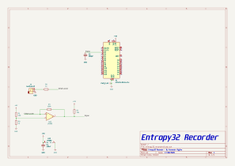

# Entropy32 Recorder


Firmware, hardware, and tooling for the Entropy32 Recorder — a standalone
Geiger-counter-based board, built around an ATmega328P (Arduino Nano form
factor), for recording raw entropy source data.

This is a **separate board from Entropy32 / Entropy32 Plus**, not a mode or
alternate firmware of it. It does not generate seeds or any conditioned
output. Its only job is to capture raw, unconditioned edge timing data from
the entropy source (Geiger tube + LM393 comparator) so it can be run through
statistical test suites (e.g. NIST STS) to validate the quality of the
entropy source itself, before that source is trusted for use in Entropy32
Plus's seed generation.

## Repository layout

- **`entropy32_evidence_protocol.md`** — the SP 800-90B reproducible
  evidence protocol these tools implement: capture requirements, the
  raw/derived evidence package layout, exact firmware reconstruction
  semantics, and the pinned NIST toolchain invocation.
- **`entropy32_recorder.ino`** — the recorder's firmware. It timestamps
  every rising edge on D2 (post-LM393 comparator output) and streams
  `edge_index,timestamp_us` CSV rows over serial. It does no filtering,
  interval pairing, or SHA-256 conditioning by design — it's for capturing
  raw edge timing data only, unmodified, for statistical testing.
- **`tools/capture_serial_to_csv.py`** — reads the serial stream produced by
  the sketch above and writes it to a CSV file matching the evidence
  protocol's `raw/raw_edges.csv` shape (`edge_index`, `raw_timer_ticks`,
  `monotonic_timestamp_us`). `raw_timer_ticks` is the board's `micros()`
  reading exactly as received (wraps every ~71.58 min);
  `monotonic_timestamp_us` is that value unwrapped into an ever-increasing
  64-bit microsecond count, reconstructed on the host (via
  `tools/edge_timing.py`) so the firmware/ISR stays minimal. Every row is
  flushed and fsynced to disk as soon as it's written — negligible cost at
  this source's event rate, and each edge is an irreplaceable physical
  event, so nothing is ever buffered short of an actual power loss. One
  capture is one continuous, uninterrupted run from edge 0 — per the
  evidence protocol, there is no resume; the tool refuses to run at all
  if `--out` already has data, and an interrupted capture must be
  restarted under a new `--out` rather than continued. On a fully
  complete run, also writes a `capture_status.json` sibling (e.g.
  `raw_edges.status.json`) recording edge count, start/end UTC
  timestamps, and the zero overrun/drop counts implied by reaching that
  point at all — this feeds `tools/package_evidence.py` and the
  protocol's `capture_status.json` (§4). Requires `pyserial`.
- **`tools/edge_timing.py`** — the timer-wrap-unwrapping math used by the
  capture tool, in its own module mainly so it can be tested in isolation.
- **`tools/check_edges.py`** — pre-flight sanity check for a captured CSV:
  confirms `edge_index`/`monotonic_timestamp_us` are well-formed, and
  compares the inter-arrival distribution against a Poisson expectation to
  flag comparator bounce/chatter. Run this before feeding a capture into
  NIST STS / SP 800-90B tooling:
  `python tools/check_edges.py tools/raw_edges.csv`.
- **`tools/derive_evidence.py`** — reconstructs Entropy32's actual
  bit-extraction (200us reject filter, non-overlapping interval pairing,
  second-longer=1/second-shorter=0, ties discarded) per
  `entropy32_evidence_protocol.md` §5,
  producing the protocol's `derived/` package — `all_intervals_us.csv`,
  `firmware_accepted_intervals_us.csv`, `comparison_bits.bin`,
  `derivation_report.json`.
  `python tools/derive_evidence.py tools/raw_edges.csv --out-dir tools/derived --source-dir ../entropy32_plus`.
  `comparison_bits.bin` is ready for `ea_non_iid -i -v comparison_bits.bin 1`
  (bits_per_symbol=1, per the protocol's §8 — not a byte-per-symbol
  truncation). `--source-dir` (optional but recommended) points at a local
  checkout of the firmware these constants are claimed to match, and
  auto-fills `derivation_report.json`'s `source_repo`/`source_commit`/
  `entropy32_firmware_blob_sha` from its git metadata and `.ino` hash —
  left `"unknown"` rather than guessed if omitted.
- **`tools/package_evidence.py`** — assembles the protocol's immutable
  evidence directory (§4) from a capture, a `derive_evidence.py` run, and
  a separately-run `ea_non_iid` pass: copies `raw/` and `derived/` in,
  records the exact NIST command/toolchain/exit status under `nist/`,
  writes `capture_status.json` and a `manifest.json` (fields it can't
  know — hardware, physical source, environment — are left `null` and
  listed on stdout for manual completion), and computes a `SHA256SUMS`
  covering every file in the package.
- **`KiCad/`** — PCB design (schematic, layout, 3D models, and
  fabrication/production outputs for the Entropy32 Recorder board).

## Hardware



The board pairs a Geiger tube's LM393 comparator output with an ATmega328P
(D2, using the board's existing pull-down for bias). Design files are in
[`KiCad/`](KiCad/), including BOM, designators, netlist, and pick-and-place
files under `KiCad/production/`.

## Usage

All commands below assume you're in the repo root (`entropy32_recorder/`)
and refer to files under `tools/` explicitly — that avoids the most common
mistake, running a later step from the wrong directory against a bare
filename that only exists one level down.

1. Flash `entropy32_recorder.ino` to the board.
2. Install the one Python dependency, then run the capture tool:

   ```
   pip install pyserial
   python tools/capture_serial_to_csv.py --port COM5 --count 2000 --out tools/raw_edges.csv
   ```

   (`--port` is a COM port like `COM5` on Windows, or a device path like
   `/dev/ttyUSB0` on Linux.) This writes `tools/raw_edges.csv` and, once
   the run completes fully, a `tools/raw_edges.status.json` sibling.
3. If the board reports `OVERRUN_DETECTED`, or the capture stops for any
   other reason (crash, USB drop, closing the terminal), that run is
   invalid per the evidence protocol — one capture is one continuous,
   uninterrupted run from edge 0. Start over under a new `--out`; there
   is no resume. Don't reuse `tools/raw_edges.csv` as the target for a new
   capture once an earlier one has already been packaged (step 7) — that
   overwrites the file the earlier package's hashes were computed from.
4. Sanity-check the result before running heavier statistical tests:

   ```
   python tools/check_edges.py tools/raw_edges.csv
   ```

5. Reconstruct Entropy32's actual bit stream:

   ```
   python tools/derive_evidence.py tools/raw_edges.csv --out-dir tools/derived --source-dir ../entropy32_plus
   ```

   This writes `tools/derived/comparison_bits.bin` (and the other
   `derived/` files) ready for the NIST tool below.
6. Run the NIST non-IID test suite against `comparison_bits.bin`.

   `ea_non_iid` is a Linux build — on Windows you'll need
   [WSL](https://learn.microsoft.com/en-us/windows/wsl/install)
   (`wsl --install`, one-time). Build it once, from inside WSL (or any
   Linux/macOS shell):

   ```bash
   sudo apt update && sudo apt install -y build-essential libbz2-dev
   git clone https://github.com/usnistgov/SP800-90B_EntropyAssessment.git
   cd SP800-90B_EntropyAssessment
   git checkout 68ed165fd7a3eeef26b87a546ba23f338e82a3f3  # pinned v1.1.8, see protocol §8
   make
   cd selftest && ./selftest && cd ..
   make non_iid
   ```

   The binaries land in `cpp/`, not the repo root — run `ea_non_iid` from
   there. From WSL, your Windows checkout is under `/mnt/<drive letter>/...`
   (e.g. `/mnt/d/Programming/entropy32_recorder`). Run it and save its
   stdout/stderr/exit status verbatim — the next step needs all three:

   ```bash
   cd SP800-90B_EntropyAssessment/cpp
   REPO=/mnt/d/Programming/entropy32_recorder
   ./ea_non_iid -i -v "$REPO/tools/derived/comparison_bits.bin" 1 \
     > "$REPO/tools/nist_stdout.txt" 2> "$REPO/tools/nist_stderr.txt"
   echo $? > "$REPO/tools/nist_exit_status.txt"
   g++ --version | head -1   # note this down for --nist-compiler-version below
   ```

7. Assemble the immutable evidence package:

   ```
   python tools/package_evidence.py \
     --raw tools/raw_edges.csv --derived-dir tools/derived --capture-id <your-id> \
     --nist-command "./ea_non_iid -i -v comparison_bits.bin 1" \
     --nist-stdout tools/nist_stdout.txt --nist-stderr tools/nist_stderr.txt \
     --nist-exit-status 0 --nist-compiler-version "<g++ --version output from step 6>"
   ```

   `--capture-status` doesn't need to be passed explicitly — it's
   auto-detected from `tools/raw_edges.status.json`. This writes
   `entropy32_sp80090b_<your-id>/` in the repo root; that directory,
   not the loose `tools/raw_edges.csv` / `tools/derived/` / `tools/nist_*`
   files that fed it, is what should get committed as the evidence record.

   Fill in whichever `manifest.json` fields it lists as left `null`
   (hardware revision, physical source, environment) by hand — see
   `entropy32_evidence_protocol.md` for what the full package and
   restart testing require beyond this.

## Known limitations / best practices for a full campaign

- **Sample size**: a few thousand edges (a few hours at typical background
  rates) is only enough for a pipeline smoke test. SP 800-90B-style
  min-entropy estimation wants **>= 1,000,000 samples** before the result
  is meaningful — plan campaign length accordingly (at the ~16 CPM
  background rate seen in the pilot run, 1M edges is roughly 6 weeks of
  continuous capture).
- **Timestamp resolution**: `micros()` on the ATmega328P (16MHz, Timer0
  prescaler 64) only increments in steps of 4us. That's negligible at the
  observed ~3.7s mean inter-arrival time (1 part in ~10^6), so it isn't a
  concern at current event rates. If a future hardware revision moves the
  comparator output to the Timer1 input-capture pin (`ICP1` / D8 on a
  Nano) instead of D2, the ISR could latch `TCNT1` directly for
  microsecond-or-better hardware-timestamped edges with no software ISR
  jitter — worth considering for a higher-throughput source, but out of
  scope for the current board (D2 is fixed on the fabricated PCB).
- **Comparator bounce**: `check_edges.py` compares the inter-arrival
  distribution against the Poisson process a radioactive source should
  produce; a pileup of anomalously short gaps indicates LM393 output
  chatter rather than genuine independent events. No bounce was observed
  in the pilot 2000-edge run.

## License

- Firmware and software (`entropy32_recorder.ino`, `tools/`): [MIT](LICENSE)
- Hardware (`KiCad/`): [CERN-OHL-S v2](LICENSE-HARDWARE)
