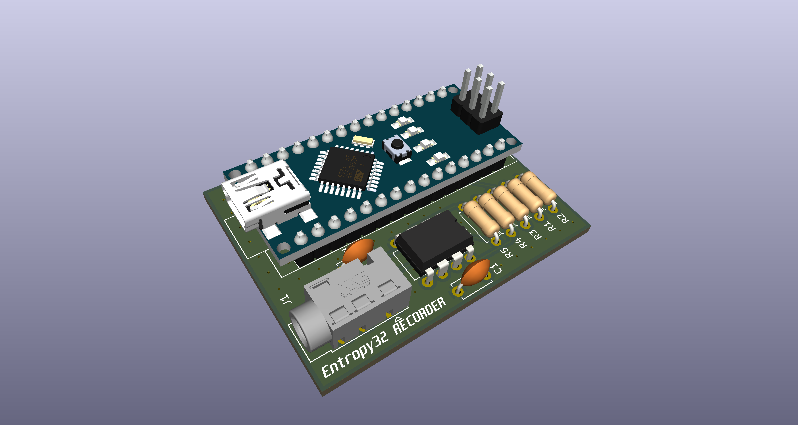

# Entropy32 Recorder



Firmware, hardware, and tooling for the Entropy32 Recorder — a standalone
Geiger-counter-based board, built around an ATmega328P (Arduino Nano form
factor), for recording raw entropy source data.

This is a **separate board from Entropy32 / Entropy32 Plus**, not a mode or
alternate firmware of it. It does not generate seeds or any conditioned
output. Its only job is to capture raw, unconditioned edge timing data from
the entropy source (Geiger tube + LM393 comparator) so it can be run through
statistical test suites (e.g. NIST STS) to validate the quality of the
entropy source itself, before that source is trusted for use in Entropy32
Plus's seed generation.

## Repository layout

- **`entropy32_recorder.ino`** — the recorder's firmware. It timestamps
  every rising edge on D2 (post-LM393 comparator output) and streams
  `edge_index,timestamp_us` CSV rows over serial. It does no filtering,
  interval pairing, or SHA-256 conditioning by design — it's for capturing
  raw edge timing data only, unmodified, for statistical testing.
- **`tools/capture_serial_to_csv.py`** — reads the serial stream produced by
  the sketch above and writes it to a CSV file matching the evidence
  protocol's `raw/raw_edges.csv` shape (`edge_index`, `raw_timer_ticks`,
  `monotonic_timestamp_us`). `raw_timer_ticks` is the board's `micros()`
  reading exactly as received (wraps every ~71.58 min);
  `monotonic_timestamp_us` is that value unwrapped into an ever-increasing
  64-bit microsecond count, reconstructed on the host so the firmware/ISR
  stays minimal. Requires `pyserial`.
- **`tools/check_edges.py`** — pre-flight sanity check for a captured CSV:
  confirms `edge_index`/`monotonic_timestamp_us` are well-formed, and
  compares the inter-arrival distribution against a Poisson expectation to
  flag comparator bounce/chatter. Run this before feeding a capture into
  NIST STS / SP 800-90B tooling: `python tools/check_edges.py raw_edges.csv`.
- **`KiCad/`** — PCB design (schematic, layout, 3D models, and
  fabrication/production outputs for the Entropy32 Recorder board).

## Hardware

The board pairs a Geiger tube's LM393 comparator output with an ATmega328P
(D2, using the board's existing pull-down for bias). Design files are in
[`KiCad/`](KiCad/), including BOM, designators, netlist, and pick-and-place
files under `KiCad/production/`.

## Usage

1. Flash `entropy32_recorder.ino` to the board.
2. Run the capture tool:

   ```
   pip install pyserial
   python tools/capture_serial_to_csv.py --port COM5 --count 2000
   ```

3. If the board reports `OVERRUN_DETECTED`, the ring buffer overflowed and
   the capture is invalid — restart it.
4. Sanity-check the result before running heavier statistical tests:

   ```
   python tools/check_edges.py raw_edges.csv
   ```

## Known limitations / best practices for a full campaign

- **Sample size**: a few thousand edges (a few hours at typical background
  rates) is only enough for a pipeline smoke test. SP 800-90B-style
  min-entropy estimation wants **>= 1,000,000 samples** before the result
  is meaningful — plan campaign length accordingly (at the ~16 CPM
  background rate seen in the pilot run, 1M edges is roughly 6 weeks of
  continuous capture).
- **Timestamp resolution**: `micros()` on the ATmega328P (16MHz, Timer0
  prescaler 64) only increments in steps of 4us. That's negligible at the
  observed ~3.7s mean inter-arrival time (1 part in ~10^6), so it isn't a
  concern at current event rates. If a future hardware revision moves the
  comparator output to the Timer1 input-capture pin (`ICP1` / D8 on a
  Nano) instead of D2, the ISR could latch `TCNT1` directly for
  microsecond-or-better hardware-timestamped edges with no software ISR
  jitter — worth considering for a higher-throughput source, but out of
  scope for the current board (D2 is fixed on the fabricated PCB).
- **Comparator bounce**: `check_edges.py` compares the inter-arrival
  distribution against the Poisson process a radioactive source should
  produce; a pileup of anomalously short gaps indicates LM393 output
  chatter rather than genuine independent events. No bounce was observed
  in the pilot 2000-edge run.

## License

- Firmware and software (`entropy32_recorder.ino`, `tools/`): [MIT](LICENSE)
- Hardware (`KiCad/`): [CERN-OHL-S v2](LICENSE-HARDWARE)
